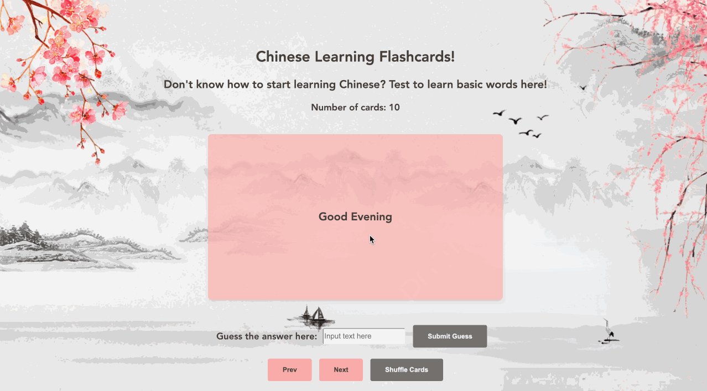

# Web Development Project 3 - *Flashcards*

Submitted by: Emily Gao Wang
Total time spent: 4 hours

## Overview

This web app allows users to test their Chinese knowledge through interactive flashcards, providing real-time feedback and navigation between cards.

## Features

**Core Functionality**

- Users can input guesses before revealing the flip side of the card.
- Visual feedback is provided on whether the guess was correct or incorrect.
- Users can navigate through the card set with next and back buttons.

**Optional Features**

- Shuffle button randomizes the order of the cards.

**Additional Features**

- Hover effects added to buttons and cards for improved user interaction.

## Video Walkthrough

Here's a walkthrough of implemented required features:

<!-- Replace this with whatever GIF tool you used! -->
GIF created with LICEcap.  
<!-- Recommended tools:
[Kap](https://getkap.co/) for macOS
[ScreenToGif](https://www.screentogif.com/) for Windows
[peek](https://github.com/phw/peek) for Linux. -->

## License

This project is licensed under the Apache License, Version 2.0. You may obtain a copy of the License at http://www.apache.org/licenses/LICENSE-2.0.
